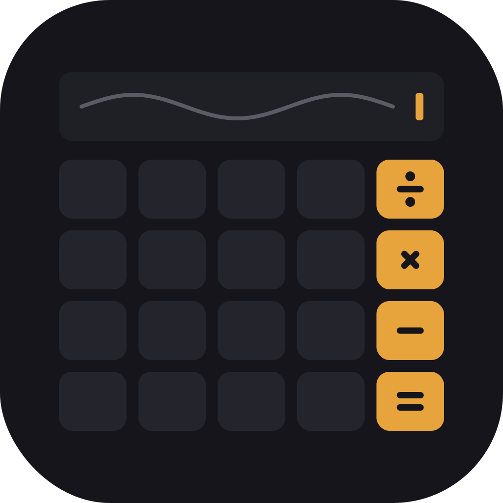

# MyCalc

A scientific calculator for Android, built in Flutter. The brief: imagine Apple's industrial
design team building a Casio. Quiet, machined, precise. Flat surfaces, one warm accent, no
gradients.

<p align="center">
  
</p>

---

## Overview

MyCalc is a single-surface app with a hamburger drawer that switches between five calculators.
All arithmetic runs through a hand-written maths engine that has zero Flutter dependencies and is
covered by unit tests. The UI never computes anything itself; it calls the engine.

Package: `com.feranmi.mycalculator`

---

## Features

- **Basic** — addition, subtraction, multiplication, division, percent, sign flip, chained
  expressions with correct precedence.
- **Scientific** — trigonometric and inverse trigonometric functions, hyperbolic functions,
  natural and base-10 logarithms, exponentials, powers and roots, factorial, constants, and a
  DEG/RAD toggle.
- **Matrix** — 2×2 to 4×4. Addition, subtraction, multiplication, scalar multiplication,
  determinant, inverse, and transpose, with clear errors for dimension mismatch and singular
  matrices.
- **Permutations & Combinations** — nPr, nCr, and factorial, computed with `BigInt` for exact
  large values.
- **Statistics** — count, sum, mean, median, mode, min, max, range, variance, and standard
  deviation (sample and population).
- **State persistence** — the active mode and inputs survive backgrounding and are restored on
  return, driven by the Android lifecycle.

---

## Design

One accent colour (`#E7A33C`) on a charcoal neutral family. Flat fills only; depth comes from a
single hairline or one elevation step, never a colour ramp. Numbers use tabular figures so the
display never shifts width. Motion is short and purposeful: a press is a small scale, a colour
change, and a haptic tick. The app icon and the in-app surfaces are the same object.

---

## Tech stack

- Flutter (stable), Dart, Material 3 host with a custom design system
- State: built-in `ChangeNotifier` and `ValueListenableBuilder`, one controller per feature
- `shared_preferences` for session persistence
- Hand-written engine — no runtime maths dependencies
- `flutter_lints`, `flutter_launcher_icons`, `flutter_native_splash` (dev)

---

## Architecture

`core/` is pure Dart and Flutter-free. `features/` holds one controller and one screen per mode.
`navigation/` owns the shell and drawer. `widgets/` and `theme/` are shared.

```
lib/
  core/
    engine/      tokenizer -> shunting-yard -> evaluator
    math/        scientific, hyperbolic, matrix, combinatorics, statistics
    format/      number formatting
    persistence/ session store
    lifecycle/   WidgetsBindingObserver
  theme/         palette, typography, metrics, app_theme
  widgets/       calc_key, key_grid, display
  navigation/    calc_mode, mode_drawer, app_shell
  features/      splash, basic, scientific, matrix, combinatorics, statistics
test/            engine and math coverage
```

---

## Maths engine

Expression input is tokenized, converted to Reverse Polish Notation with the shunting-yard
algorithm (correct operator precedence, right-associative `^`, unary minus, function calls), then
evaluated. Trigonometric functions respect the DEG/RAD mode. Matrix, combinatorics, and
statistics are direct computations rather than expression parsing. Domain errors, division by
zero, singular matrices, and overflow are thrown as typed exceptions and rendered as short
messages.

---

## Android lifecycle

The app demonstrates the lifecycle concepts the course covers. `lifecycle_observer.dart`
implements `WidgetsBindingObserver` and responds to `didChangeAppLifecycleState`, mapping to the
Android Activity callbacks:

| AppLifecycleState | Android callback                   |
| ----------------- | ---------------------------------- |
| resumed           | onResume                           |
| inactive          | onPause (transient)                |
| paused            | onPause then onStop (backgrounded) |
| hidden            | onStop                             |
| detached          | onDestroy                          |

On `paused` the current mode and inputs are persisted; on `resumed` they are restored. The native
entry point remains `MainActivity` as a `FlutterActivity`, whose `onCreate` is the Android entry
point described in the lecture slides.

---

## Getting started

Requirements: Flutter (stable channel), the Android SDK, and a device or emulator.

```bash
git clone https://github.com/Ferousco-dev/SEN104_CALCULATOR-ASSIGNMENT.git
cd mycalculator
flutter pub get
flutter run
```

## Build a release APK

```bash
flutter build apk --release
```

The APK is written to `build/app/outputs/flutter-apk/app-release.apk`.

## Run the tests

```bash
flutter test
```

---

## Project context

Built for the SEN 104 & 214 scientific calculator assignment. The minimum requirement is the four
basic operations; this submission extends to scientific, hyperbolic, matrix, combinatorics, and
statistical operations, with lifecycle-aware state persistence.

---

## License

MIT. See `LICENSE`.

## Author

Feranmi.
